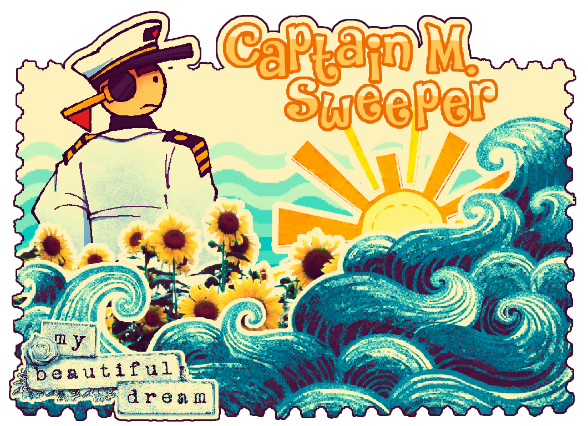

  
  

 feel free to c+h when i'm captain sweeper ^_^  
 i'm socially akward, or probably the other way around so, do tell me if i'm being too much !  
 captain sweeper is my half-fictionkin, my behaviour is much different to him when i'm not srs.  
 sometimes sitting/hour-farming around docks, i will join hostings if they seem interesting  
 https://melvin.atabook.org/ \<\- here if u wanted to go to my atabook faster  
 i cannot draw captain consistently ong  
 

<!--
**the-minesweeper/the-minesweeper** is a ✨ _special_ ✨ repository because its `README.md` (this file) appears on your GitHub profile.

Here are some ideas to get you started:

- 🔭 I’m currently working on ...
- 🌱 I’m currently learning ...
- 👯 I’m looking to collaborate on ...
- 🤔 I’m looking for help with ...
- 💬 Ask me about ...
- 📫 How to reach me: ...
- 😄 Pronouns: ...
- ⚡ Fun fact: ...
-->
